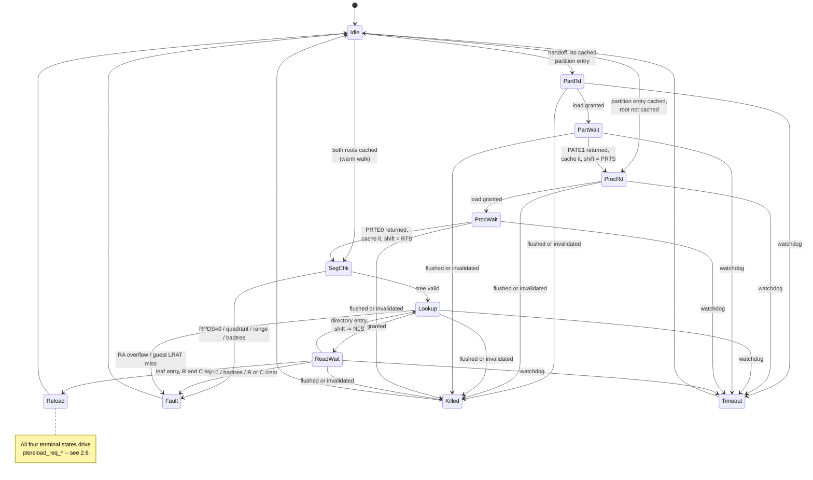
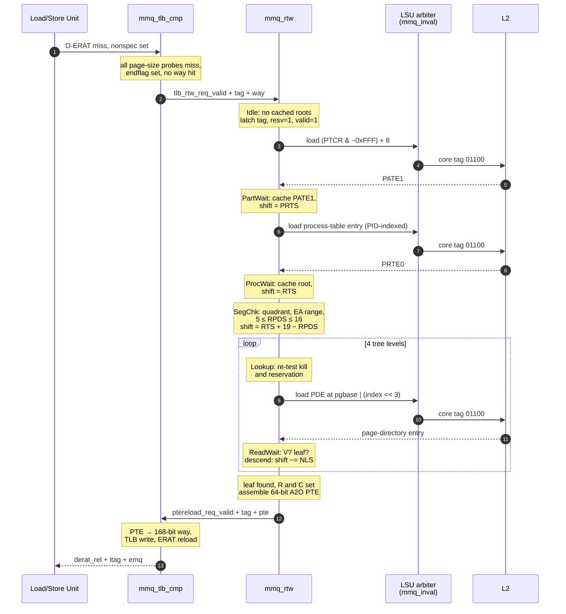

# 02 — The state machine

[← 01 Background](01-background.md) · [Index](00-README.md) · Next: [03 — Datapath](03-datapath.md)

The walker is `a2o/rel/src/verilog/work/mmq_rtw.v`. It contains **two independent walk
contexts**, each running its own copy of the sequencer described here, statically bound one
per hardware thread. This document describes one context.

---

## 2.1 State encoding

Twelve states, four bits (`mmq_rtw.v:213-224`):

```verilog
// Idle is all-zeros so that an AND-mask kill returns to Idle, matching the
// tlb_seq_abort idiom at mmq_tlb_ctl.v:1376-1378.
// Single-bit transitions along the nominal path, as in mmq_tlb_ctl.v:343-375.
parameter [0:3] RtwSeq_Idle     = 4'b0000;
parameter [0:3] RtwSeq_PartRd   = 4'b0001;
parameter [0:3] RtwSeq_PartWait = 4'b0011;
parameter [0:3] RtwSeq_ProcRd   = 4'b0010;
parameter [0:3] RtwSeq_ProcWait = 4'b0110;
parameter [0:3] RtwSeq_SegChk   = 4'b0111;
parameter [0:3] RtwSeq_Lookup   = 4'b0101;
parameter [0:3] RtwSeq_ReadWait = 4'b0100;
parameter [0:3] RtwSeq_Reload   = 4'b1100;
parameter [0:3] RtwSeq_Fault    = 4'b1101;
parameter [0:3] RtwSeq_Killed   = 4'b1111;
parameter [0:3] RtwSeq_Timeout  = 4'b1110;
```

Two properties of the encoding are deliberate and follow A2O house style:

- **`Idle` is all zeros.** A2O's existing TLB sequencer aborts by AND-masking its state
  vector to zero, which only works as "return to idle" because idle is zero
  (`mmq_tlb_ctl.v:1376-1378`). The same idiom disables this walker when radix is off:
  `ctx_seq_din[i] = ctx_seq_d[i] & {4{mmucr1_rxe}}`.
- **The nominal path is single-bit adjacent.** `Idle → PartRd → PartWait → ProcRd →
  ProcWait → SegChk → Lookup → ReadWait` changes exactly one bit per step, matching the Gray
  coding of `mmq_tlb_ctl.v:343-375`.

## 2.2 State table

| State | Encoding | Purpose | Exits to |
|---|---|---|---|
| `Idle` | `0000` | Wait for a handoff; decide how much of the tree is already cached | `PartRd` / `ProcRd` / `SegChk` |
| `PartRd` | `0001` | Request the partition-table entry at `(PTCR & ~0xFFF) + 8` | `PartWait`, `Killed`, `Timeout` |
| `PartWait` | `0011` | Await PATE1; cache it; extract PRTS | `ProcRd`, `Fault`, `Killed`, `Timeout` |
| `ProcRd` | `0010` | Request the process-table entry, indexed by PID | `ProcWait`, `Killed`, `Timeout` |
| `ProcWait` | `0110` | Await PRTE0; cache it; extract RTS | `SegChk`, `Fault`, `Killed`, `Timeout` |
| `SegChk` | `0111` | Validate quadrant, address range and tree sanity | `Lookup`, `Fault` |
| `Lookup` | `0101` | Request one page-directory entry | `ReadWait`, `Killed`, `Fault`, `Timeout` |
| `ReadWait` | `0100` | Decode the entry: leaf, descend, or fault | `Reload`, `Lookup`, `Fault`, `Killed`, `Timeout` |
| `Reload` | `1100` | **Terminal, success.** Present the translation | `Idle` |
| `Fault` | `1101` | **Terminal, architected fault.** Present V=0 | `Idle` |
| `Killed` | `1111` | **Terminal, flushed or invalidated.** Present V=0 | `Idle` |
| `Timeout` | `1110` | **Terminal, watchdog.** Present V=0, machine check | `Idle` |

All four terminal states drive the same output handshake. That is not redundancy — it is the
single most important safety property in the module, and is explained in
[§2.6](#26-why-every-exit-goes-through-the-same-handshake).

## 2.3 State diagram



## 2.4 Flow of events: a cold four-level walk

Six memory accesses: partition table, process table, then four tree levels.



Each of the six accesses is a full L2 round trip, and the MMU holds **one** credit token
shared with TLB invalidate traffic, so they are strictly serial. A cold walk is expensive.

## 2.5 The warm walk

The partition-table entry and both quadrant roots are cached in the module with valid bits,
mirroring Microwatt (`mmu.vhdl:1544-1560`). They are dropped on `mtspr PTCR` (all three) and
`mtspr PID` (the quadrant-0 root only). With both cached, `Idle` jumps straight to `SegChk`
and the walk costs **four** loads instead of six.

This is a larger win here than in Microwatt. With only one LSU credit token, every table
read skipped removes an entire serialised L2 round trip from the critical path. The
testbench asserts both counts explicitly — 6 cold, 4 warm.

## 2.6 Why every exit goes through the same handshake

A2O's load/store unit allocates an **ERAT Miss Queue** entry for every translation request.
There are four entries, one reserved for the oldest instruction. An entry is freed *only* by
a returning reload; a pipeline flush marks it killed but does **not** deallocate it
(`lq_derat.v:4503-4512`).

Therefore a walk that ends without returning something leaks an EMQ entry permanently, and
after four such events that thread can never take another translation miss — it hangs. All
four terminal states drive `ptereload_req_*`; the successful one presents a valid entry, the
other three present `V=0` so the downstream logic discards the translation while still
freeing the queue entry.

```verilog
// mmq_rtw.v — Killed, one of the three fault-like terminal states
RtwSeq_Killed :
   begin
      ctx_seq_reload[i] = 1'b1;      // still hand something back
      seq_install_valid = 1'b0;      // but V=0, so nothing is installed
      if (ctx_reload_taken[i] == 1'b1)
      begin
         seq_valid_clr   = 1'b1;
         ctx_seq_done[i] = 1'b1;
         ctx_seq_d[i]    = RtwSeq_Idle;
      end
   end
```

The testbench checks this on every fault path, and the flush and invalidate scenarios assert
it explicitly with an "EMQ LEAK" failure message.

## 2.7 The segment check

Transcribed from `mmu.vhdl:1667-1685` (`mmq_rtw.v:1099`):

```verilog
RtwSeq_SegChk :
   begin
      ctx_masksize_d[i] = root_rpds;
      ctx_pgbase_d[i]   = nlb_base;
      ctx_shift_d[i]    = seg_newshift;          // RTS + 19 − RPDS
      ctx_fetch_d[i]    = Fetch_Pde;
      if (root_rpds == 5'b00000)                 // RPDS=0 disables radix
      begin
         ctx_fault_d[i] = Flt_Invalid;
         ctx_seq_d[i]   = RtwSeq_Fault;
      end
      else if ((epn[0] != epn[1]) | (seg_nonzero == 1'b1))
      begin                                      // quadrants 1 and 2 are unmapped;
         ctx_fault_d[i] = Flt_SegError;          // EA above 31+RTS must be zero
         ctx_seq_d[i]   = RtwSeq_Fault;
      end
      else if ((root_rpds < 5'd5) | (root_rpds > 5'd16) |
               ({1'b0, root_rpds} > (ctx_shift_q[i] + 6'd19)))
      begin
         ctx_fault_d[i] = Flt_BadTree;
         ctx_seq_d[i]   = RtwSeq_Fault;
      end
      else
         ctx_seq_d[i] = RtwSeq_Lookup;
   end
```

## 2.8 The descend decision, and why there is no level counter

`ReadWait` (`mmq_rtw.v:1158`) decodes the returned doubleword. The valid bit is bit 0 in
A2O's MSB-first numbering, the leaf bit is bit 1 (see
[03-datapath](03-datapath.md#bit-order)).

```verilog
else if (pde_leaf == 1'b1)
begin
   if (rc_ok == 1'b0)                            // R clear, or C clear
   begin
      ctx_fault_d[i] = Flt_RcErr;
      ctx_seq_d[i]   = RtwSeq_Fault;
   end
   else
      ctx_seq_d[i] = RtwSeq_Reload;
end
else
begin
   // descend. Termination is shift exhaustion, guarded by NLS > shift --
   // there is no explicit level counter, exactly as in Microwatt
   // (mmu.vhdl:1719-1736).
   if ((pde_nls < 5'd5) | (pde_nls > 5'd16) |
       ({1'b0, pde_nls} > ctx_shift_q[i]))
   begin
      ctx_fault_d[i] = Flt_BadTree;
      ctx_seq_d[i]   = RtwSeq_Fault;
   end
   else
   begin
      ctx_shift_d[i]    = ctx_shift_q[i] - {1'b0, pde_nls};
      ctx_masksize_d[i] = pde_nls;
      ctx_pgbase_d[i]   = nlb_base;
      ctx_seq_d[i]      = RtwSeq_Lookup;
   end
end
```

The absence of a level counter is worth noting because it looks like an omission and is not.
The remaining shift amount *is* the loop variable: it starts at `RTS + 19 − RPDS`, decreases
by `NLS` at each level, and the guard `NLS > shift` catches a tree that claims more index
bits than remain. A four-level limit is architectural, not structural — the same logic
handles any legal tree shape.

## 2.9 Where the kill test is applied

The kill and reservation conditions are tested **both** before issuing a load and on the way
out of every wait state. Gating only the request states was a real bug found in testing: a
flush arriving during the final `ReadWait` let the walk run to completion and install a
translation it should not have. See
[06-verification](06-verification.md#bugs-found-by-the-benches).

```verilog
else if (ctx_dataval_q[i] == 1'b1)
begin
   // P0-1 / P0-4: also test the kill and reservation on the way OUT of a wait
   // state. Safe here: dataval means the load already returned, so this never
   // abandons an in-flight reload.
   if (ctx_kill_now[i] | ctx_killed_q[i] | (~ctx_resv_q[i]))
      ctx_seq_d[i] = RtwSeq_Killed;
   else
   ...
```

Killing is never done *mid-load*. The L2 reload is already in flight and will arrive tagged;
it must be drained. The `killed` flag is latched when the flush arrives and acted upon at the
next state boundary.

---

**Not covered here:** the arithmetic behind `addrsh`, the masks and the address formation
([03](03-datapath.md)); how the module reaches the rest of the core ([04](04-integration.md));
and why the kill, reservation and watchdog machinery exists at all ([05](05-ooo-safety.md)).
